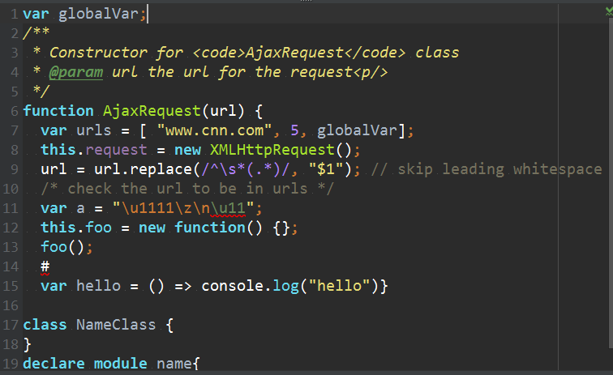
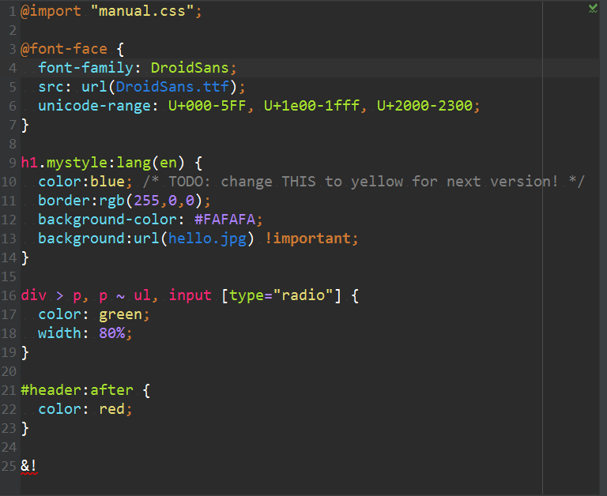

# 我目前使用的PyCharm颜色和其他配置
## 类似sublime但是有自己的喜好
### Python效果

### Java Script效果

### Html 效果

### CSS 效果

## 如果想使用我的可以直接导入导入方法
Pycharm左上角->File->Import Settings->选择(Pycharm_Color_Shuai_20170510.jar)

## 如果你想分享你自己的颜色配色和Pycharm配置
Pycharm左上角->File->Export Settings->保存文件即可

### 参考
https://github.com/spasserby/PyCharm-monokai
可以下载这个为原生类似sublime的效果，然后在做自己的修改
