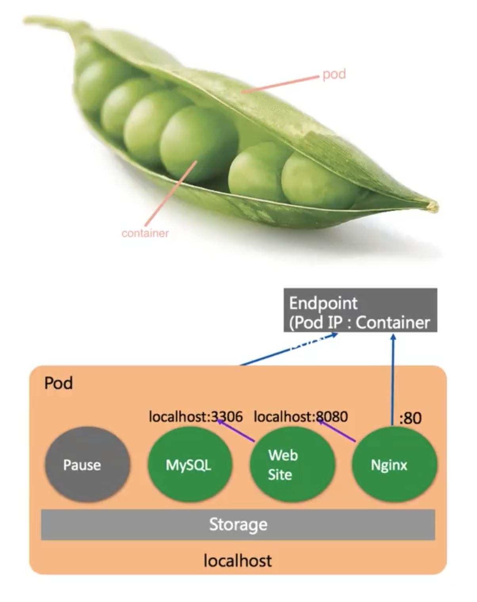
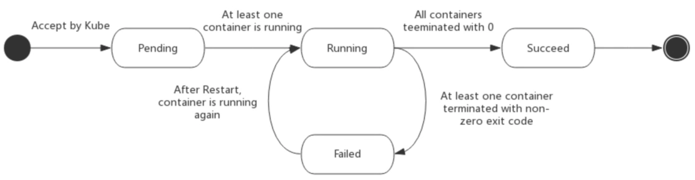

[TOC]

# 初识Pod

Pods是Kubernetes集群的最小管理单元，我们在发布的时候不是发布的容器，而是Pod

Pod里包含了1个或者多个容器（container）、存储、网络、以及如何运行的规范

## 为什么会有Pod这种模式

因为在很多情况下，一个服务可能是由: web程序、memcached、mysql紧密耦合才能提供服务的，所以有了pod这个概念



## Pod主要有两种使用

* 单Pod单容器：One-container-per-Pod，最常见的Kubernetes用例，在这种情况下可以将Pod视为单个容器的封装，而Kubernetes直接管理Pod而不是容器
* 运行多个需要协同工作的容器的Pod：Pod封装由多个容器组成的应用程序，这些容器紧密耦合共享资源

## 如何管理容器

* 网络：每个Pod会分配一个唯一的IP，Pod中每个容器都共享网络命名空间，包括IP地址端口，Pod内的容器可里理解为在一个主机上并且可以使用localhosts通信。当Pod中的容器与Pod外部通信必须协调他们如何使用共享资源（比如端口）
* 存储：Pod可以指定一组共享存储卷。Pod中的所有容器都可以访问共享存储卷，从而允许这些容器共享数据。如果需要重新启动其中一个容器，则卷还允许卷中的数据持久存储

## 

* 每当启动一个Pod，同时会启动一个pause容器（伴随容器），pause容器伴随的Pod启动，伴随的Pod销毁。
* pause容器实现了Pod容器共享网络空间


> 备注:k8s并没有针对运行时、网络、存储提供相应的组件只是提供了对应的接口
>
> CRI（Container Runtime Interface），CNI（Container Network Interface）,CSI（Container Storage Interface）

在容器内部通过pause容器实现了Pod容器共享网络空间


## Pod的运行状态

| Value               | Description                                                  |
| ------------------- | ------------------------------------------------------------ |
| Pending(待定状态)   | The Pod has been accepted by the Kubernetes cluster, but one or more of the containers has not been set up and made ready to run. This includes time a Pod spends waiting to be scheduled as well as the time spent downloading container images over the network.（一般是等待镜像下载或者网络就绪） |
| Running（正常运行） | The Pod has been bound to a node, and all of the containers have been created. At least one container is still running, or is in the process of starting or restarting. |
| Succeeded           | All containers in the Pod have terminated in success, and will not be restarted. |
| Failed              | All containers in the Pod have terminated, and at least one container has terminated in failure. That is, the container either exited with non-zero status or was terminated by the system. |
| Unknown             | For some reason the state of the Pod could not be obtained. This phase typically occurs due to an error in communicating with the node where the Pod should be running.（一般是到网络不通导致） |
|                     |                                                              |
|                     |                                                              |




# 创建Pod

## 通过yaml创建

通过yaml创建

```yaml
apiVersion: v1
kind: Pod
metadata:
  name: pod-mem
  labels:
    app: pmem
spec:
  containers:
   - name: container-mem
     image: progrium/stress
     command: ["stress"]
     args: ["--vm", "1", "--vm-bytes", "150M", "--vm-hang", "1"] 
```


```
root@cka01:~/yaml# kubectl create -f memory-demon.yaml

root@cka01:~/yaml# kubectl get pod -o wide
NAME      READY   STATUS    RESTARTS   AGE   IP              NODE    NOMINATED NODE   READINESS GATES
pod-mem   1/1     Running   0          58s   10.244.204.71   cka03   <none>           <none>
```

## containers

### Pod中containers指定镜像下载策略: imagePullPolicy

我们制定了镜像，镜像下载有3中模式

* Always：每次都下载
* Never：只是用本地镜像，从不下载
* IfNotPresent：只有当本地没有的时候才去下载

```yaml
....
  containers:
   - name: container-mem
     image: progrium/stress
     imagePullPolicy: IfNotPresent
     command: ["stress"]
     args: ["--vm", "1", "--vm-bytes", "150M", "--vm-hang", "1"] 
```

###  Pod中containers指定资源配额: resources

给容器设置资源配额

```yaml
apiVersion: v1
kind: Namespace
metadata:
  name: demon-1
    
---
apiVersion: v1
kind: Pod
metadata:
  name: pod-mem
  namespace: demon-1
spec:
  containers:
   - name: container-mem
     image: polinux/stress
     imagePullPolicy: IfNotPresent
     resources:
       limits:
         memory: "200Mi"   # 这里限制最多200M
       requests:
         memory: "100Mi"   # 我请求100M哪里有资源调度到哪里去
     command: ["stress"]
     args: ["--vm", "1", "--vm-bytes", "150M", "--vm-hang", "1"]   # 这里程序运行需要150M会一直用150M

```

> 小技巧: 看上面我们已经接触到Namespace了现在可以通过-n先锁定命名空间在锁定资源了，这样在使用table的时候可以自动补全

```
root@cka01:~/yaml# kubectl -n demon-1 get pod pod-mem 
NAME      READY   STATUS    RESTARTS   AGE
pod-mem   1/1     Running   0          6m39s
```

限制临时存储空间的大小

```yaml
apiVersion: v1
kind: Pod
metadata:
  name: frontend
spec:
  containers:
  - name: app
    image: images.my-company.example/app:v4
    resources:
      requests:
        ephemeral-storage: "2Gi"
      limits:
        ephemeral-storage: "4Gi"
  - name: log-aggregator
    image: images.my-company.example/log-aggregator:v6
    resources:
      requests:
        ephemeral-storage: "2Gi"
      limits:
        ephemeral-storage: "4Gi"
```

### Pod中containers指定环境变量: env

容器内部设置环境变量

```yaml
apiVersion: v1
kind: Pod
metadata:
  name: testvm
  labels:
    type: vm
  annotations:
    description: "hello kubernetes"
spec:
  containers:
    - name: test-vm-1
      image: polinux/stress
      imagePullPolicy: IfNotPresent
      env:
        - name: x1
          value: y1
        - name: x2
          value: y2
      command: ["stress"]
      args: ["--vm", "1", "--vm-bytes", "150M", "--vm-hang", "1"]
```

### Pod中containers声明端口和端口映射

```yaml
apiVersion: v1
kind: Pod
metadata:
  name: web1
  labels:
    type: nginx
  annotations:
    description: "hello kubernetes"
spec:
  containers:
    - name: nginx1
      image: nginx:1.21
      imagePullPolicy: IfNotPresent
      ports:
        - name: web            # 端口映射命名web
          containerPort: 80    # web声明容器端口
          protocol: TCP        # web声明协议
          hostPort: 8081       # 将web声明的容器80端口映射到宿主机8081端口
```

### Pod中containers健康检测

健康检测，场景：

比如我有一个数据库我执行了kubectl create -f mysql.yaml 很快就看到Pod状态Running了，但是我mysql有一个40秒的初始化时间，如果你在这40秒内访问就是是异常的

比如我的nginx运行了1周时间了突然无法访问，但是容器还是Running的状态

> **`所以Running状态并不代表容器是健康的`**

#### 三种探测器

一个是启动前的检测

* startupProbe  启动前检测如果检测失败启动则失败

两个是启动后的检测

* livenessProbe  运行探活，如果失败默认杀死container然后kubernetes会重新创建容器，如果未提供探活动探测，则状态为sucess
* readinessProbe  就绪探活，如果失败删除PodIP并设置状态为Failure，如果未提供就绪探测，默认状态为sucess

最开始是没有startupProbe的，只需要在启动后检测，但是有个问题就是，在启动后检测你不知道要等多久

#### 三种探针(上面的三种探测器都可以使用它们)

* exec：执行指定的命令，根据退出码验证，如果未0则成功
* tcpSocket：根据container的IP对应的TCP端口检测，如果端口打开则认为是成功的
* httpGet：对指定端口执行Http Get请求如果大于200小于400则认为是正常的

#### livenessProbe & readinessProbe

```yaml
apiVersion: v1
kind: Pod
metadata:
  name: health-pod
spec:
  containers:
    - name: buybox1
      image: busybox
      imagePullPolicy: IfNotPresent
      command: ["/bin/sh", "-c"]
      args:
        - touch /tmp/health ; sleep 20; rm -f /tmp/health ; sleep 600;
      livenessProbe:
        exec:
          command:
            - cat
            - /tmp/health
        initialDelaySeconds: 10    # 容器启动多久后开始检测
        periodSeconds: 3           # 多久检测1次
        failureThreshold: 3        # 几次失败算失败

```

```
Events:
  Type     Reason     Age                 From               Message
  ----     ------     ----                ----               -------
  Normal   Scheduled  112s                default-scheduler  Successfully assigned default/health-pod to cka003
  Normal   Pulling    112s                kubelet            Pulling image "busybox"
  Normal   Pulled     101s                kubelet            Successfully pulled image "busybox" in 11.173907804s
  Normal   Created    43s (x2 over 101s)  kubelet            Created container buybox1
  Normal   Started    43s (x2 over 101s)  kubelet            Started container buybox1
  Normal   Pulled     43s                 kubelet            Container image "busybox" already present on machine
  Warning  Unhealthy  16s (x6 over 79s)   kubelet            Liveness probe failed: cat: can't open '/tmp/health': No such file or directory
  Normal   Killing    16s (x2 over 73s)   kubelet            Container buybox1 failed liveness probe, will be restarted
```

> 关注下: Pod的状态就会发现它已经重启过了

```
NAME         READY   STATUS    RESTARTS   AGE
health-pod   1/1     Running   3          3m8s
```

>  它和: readinessProbe和livenessProbe 的区别就是它失败了不重启，自己选择下

#### startupProbe

启动前检测，这个要单独说下，我们上面定义的启动后检测，但是有个问题但是有写情况下可能启动时长是未知的。。。。。

这种情况下比如我我们定义了:initialDelaySeconds 等待10秒后检测但是可能花了40秒才启动，那30秒已经提供服务了，就会对用户造成影响

所以就有了一个启动前检测，检测通过后就在往后走

```yaml
apiVersion: v1
kind: Pod
metadata:
  name: health-pod
spec:
  containers:
    - name: buybox1
      image: busybox
      imagePullPolicy: IfNotPresent
      command: ["/bin/sh", "-c"]
      args:
        - sleep 10; touch /tmp/health ; sleep 20; rm -f /tmp/health ; sleep 600;
      startupProbe: # 启动检测
        exec:
          command:
            - cat
            - /tmp/health
        initialDelaySeconds: 1     # 容器启动多久后开始检测
        periodSeconds: 3           # 多久检测1次
        failureThreshold: 10       # 几次失败算失败
      livenessProbe:
        exec:
          command:
            - cat
            - /tmp/health
        initialDelaySeconds: 10    # 容器启动多久后开始检测
        periodSeconds: 3           # 多久检测1次
        failureThreshold: 3        # 几次失败算失败

```

```
Events:
  Type     Reason     Age                From               Message
  ----     ------     ----               ----               -------
  Normal   Scheduled  43s                default-scheduler  Successfully assigned default/health-pod to cka002
  Normal   Pulled     42s                kubelet            Container image "busybox" already present on machine
  Normal   Created    42s                kubelet            Created container buybox1
  Normal   Started    42s                kubelet            Started container buybox1
  Warning  Unhealthy  33s (x3 over 39s)  kubelet            Startup probe failed: cat: can't open '/tmp/health': No such file or directory
  Warning  Unhealthy  4s (x3 over 10s)   kubelet            Liveness probe failed: cat: can't open '/tmp/health': No such file or directory
  Normal   Killing    4s                 kubelet            Container buybox1 failed liveness probe, will be restarted
root@cka001:~/yaml/pod#
```


## Pod数据

### emptyDir

emptyDir在Pod分配给节点时，首先创建有一个卷，这个卷开始是空的，容器内所有的container都可以挂载这个卷把数据同时写在一个地方

* emptyDir声明周期会随着Pod终结而终结
* 如果Pod异常退出emptyDir不会被销毁

```yaml
apiVersion: v1
kind: Pod
metadata:
  name: web1
  labels:
    type: nginx
  annotations:
    description: "hello kubernetes"
spec:
  volumes:
    - name: html-data
      emptyDir:

  containers:
    - name: test-vm-1
      image: polinux/stress
      imagePullPolicy: IfNotPresent
      volumeMounts:
        - name: html-data
          mountPath: /usr/share/nginx/html
      command: ["stress"]
      args: ["--vm", "1", "--vm-bytes", "150M", "--vm-hang", "1"]
    - name: nginx1
      image: nginx:1.21
      imagePullPolicy: IfNotPresent
      volumeMounts:
        - name: html-data
          mountPath: /usr/share/nginx/html
      ports:
        - name: web            # 端口映射命名
          containerPort: 80    # 声明容器端口
          protocol: TCP        # 声明协议
          hostPort: 8081       # 将声明的容器端口映射到宿主机

```

### hostPath

把宿主目录映射到容器中docker -v参数

```yaml
apiVersion: v1
kind: Pod
metadata:
  name: web1
  labels:
    type: nginx
  annotations:
    description: "hello kubernetes"
spec:
  volumes:
    - name: html-data
      hostPath:
        path: /data/html/

  containers:
    - name: nginx1
      image: nginx:1.21
      imagePullPolicy: IfNotPresent
      volumeMounts:
        - name: html-data
          mountPath: /usr/share/nginx/html
      ports:
        - name: web            # 端口映射命名
          containerPort: 80    # 声明容器端口
          protocol: TCP        # 声明协议
          hostPort: 8081       # 将声明的容器端口映射到宿主机
```


## hostNetwork 

pod直接使用宿主的网络空间

```yaml
apiVersion: v1
kind: Pod
metadata:
  name: web1
  labels:
    type: nginx
  annotations:
    description: "hello kubernetes"
spec:
  hostNetwork: true
  containers:
    - name: nginx1
      image: nginx:1.21
      imagePullPolicy: IfNotPresent
      ports:
        - name: web            # 端口映射命名
          containerPort: 80    # 声明容器端口
          protocol: TCP        # 声明协议
```


```
# 这里直接使用的是宿主的网段
root@cka001:~/yaml/pod# kubectl get pods -o wide
NAME   READY   STATUS    RESTARTS   AGE   IP             NODE     NOMINATED NODE   READINESS GATES
web1   1/1     Running   0          6s    172.24.238.9   cka003   <none>           <none>
```


## hostAliases

切片对象，包含IP和hostnames，会写入容器的hosts文件里

```yaml
apiVersion: v1
kind: Pod
metadata:
  name: web1
  labels:
    type: nginx
  annotations:
    description: "hello kubernetes"
spec:
  hostAliases:
    - ip: "172.24.238.8"
      hostnames: "cka01"
    - ip: "172.25.159.103"
      hostnames: "cka02"
  containers:
    - name: nginx1
      image: nginx:1.21
      imagePullPolicy: IfNotPresent
      ports:
        - name: web            # 端口映射命名
          containerPort: 80    # 声明容器端口
          protocol: TCP        # 声明协议
```

```
root@web1:/# cat /etc/hosts
# Kubernetes-managed hosts file.
127.0.0.1	localhost
::1	localhost ip6-localhost ip6-loopback
fe00::0	ip6-localnet
fe00::0	ip6-mcastprefix
fe00::1	ip6-allnodes
fe00::2	ip6-allrouters
192.168.102.13	web1

# Entries added by HostAliases.
172.24.238.8	cka01	master
172.25.159.103	cka02	worker
```


# Pod删除

* 如果删除了Namespaces里面的资源都会被删除

```
# 建议通过yaml删除
kubectl delete -f 2-pod-reouce-limit.yaml
```

# 登录Pod容器

先创建一个

```yaml
apiVersion: v1
kind: Namespace
metadata:
  name: demon
    
---
apiVersion: v1
kind: Pod
metadata:
  name: pod-mem
  namespace: demon
spec:
  containers:
   - name: container-mem-1
     image: polinux/stress
     imagePullPolicy: IfNotPresent
     resources:
       limits:
         memory: "200Mi"
       requests:
         memory: "100Mi"
     command: ["stress"]
     args: ["--vm", "1", "--vm-bytes", "150M", "--vm-hang", "1"] 
   - name: container-mem-2
     image: polinux/stress
     imagePullPolicy: IfNotPresent
     resources:
       limits:
         memory: "200Mi"
       requests:
         memory: "100Mi"
     command: ["stress"]
     args: ["--vm", "1", "--vm-bytes", "150M", "--vm-hang", "1"]
```


```
# 默认登录第一个容器
kubectl -n demon exec pod-mem -it bash

# 如果多个容器可以选择制定容器
kubectl -n demon exec pod-mem -it -c container-mem-1 bash
```


# 对已经创建的Pod修改-不建议使用

```
 kubectl edit pod pod-mem
```

# 通过标签选择Pod

先创建一个Pod

```yaml
apiVersion: v1
kind: Pod
metadata:
  name: pod-mem
  labels: 
    app: test
spec:
  containers:
   - name: container-mem-1
     image: polinux/stress
     imagePullPolicy: IfNotPresent
     resources:
       limits:
         memory: "200Mi"
       requests:
         memory: "100Mi"
     command: ["stress"]
     args: ["--vm", "1", "--vm-bytes", "150M", "--vm-hang", "1"] 
```

## apply申请-更新

```yaml
apiVersion: v1
kind: Pod
metadata:
  name: pod-mem
  labels: 
    app: demon
spec:
  containers:
   - name: container-mem-1
     image: polinux/stress
     imagePullPolicy: IfNotPresent
     resources:
       limits:
         memory: "200Mi"
       requests:
         memory: "100Mi"
     command: ["stress"]
     args: ["--vm", "1", "--vm-bytes", "150M", "--vm-hang", "1"] 
```

修改了后现在就不能用create了，需要是apply~

# edit 或通过patch修改

```
kubectl edit pod pod-mem
```

```
kubectl patch pod pod-mem -p '"metadata": {"labels": {"app": "demon"}}'
```

> 这两种修改的方式如果只修改labels，annannotations不会被修改，很容易忘记，所以一般建议都通过yaml去做

# init container

这个容器比较特殊比如说你有一个nginx容器，你需要先把nginx配置文件拉下来在启动nginx服务，这个时候可以使用init，如果先启动的nginx容器在拉配置，会导致nginx配置不生效

* init container总是需要执行完且成功
* 如果init container执行失败kubernetes会一直尝试去执行它知道成功
* 如果指定了多个init container会把所有的init container都执行完才执行后面的容器启动

## 应用场景

* 进行应用初始化，比如下载配置文件拉代码
* 服务启动前的依赖检查，比如web服务启动前先验证mysql是否启动

## 例子

yaml

```yaml
apiVersion: v1
kind: Pod
metadata:
  name: pod-mem
  labels: 
    app: demon
spec:
  containers:
   - name: container-mem-1
     image: polinux/stress
     imagePullPolicy: IfNotPresent
     resources:
       limits:
         memory: "200Mi"
       requests:
         memory: "100Mi"
     command: ["stress"]
     args: ["--vm", "1", "--vm-bytes", "150M", "--vm-hang", "1"] 
   - name: container-mem-2
     image: polinux/stress
     imagePullPolicy: IfNotPresent
     resources:
       limits:
         memory: "200Mi"
       requests:
         memory: "100Mi"
     command: ["stress"]
     args: ["--vm", "1", "--vm-bytes", "150M", "--vm-hang", "1"]

  initContainers:
   - name: container-init-1
     image: busybox:1.28
     imagePullPolicy: IfNotPresent
     command: ["sh", "-c", "echo init containers 1 && sleep 10"]
   - name: container-init-2
     image: busybox:1.28
     imagePullPolicy: IfNotPresent
     command: ["sh", "-c", "echo init containers 2 && sleep 20"]
```


```
kubectl create -f 4-mem.yaml

root@cka01:~/yaml# kubectl get pod --watch
NAME      READY   STATUS     RESTARTS   AGE
pod-mem   0/2     Init:0/2   0          41s
pod-mem   0/2     Init:1/2   0          42s
pod-mem   0/2     Init:1/2   0          43s
pod-mem   0/2     PodInitializing   0          63s
pod-mem   2/2     Running           0          64s
```

# static pod 静态Pod

它不是由API管理的而是由节点上的kubelet通过配置文件进行管理的，如果挂了kubelet就会自动拉起它

* Static Pod总是绑定在一个特定的节点上
* Kubelet会自动尝试为Static Pod去注册一个镜像POD，虽然不可以用来管理但是可以看到它

Kubeadm部署的集群Static Pod默认放在/etc/kubernetes/manifests/ 目录中

`创建一个静态Pod`

```yaml
root@cka03:/etc/kubernetes/manifests# cat nginx.yaml 
apiVersion: v1
kind: Pod
metadata:
  name: nginx
  labels: 
    app: nginx
spec:
  containers:
    - name: nginx-1
      image: nginx
      imagePullPolicy: IfNotPresent
      ports:
        - name: container-nginx
          containerPort: 80
          protocol: TCP
```

